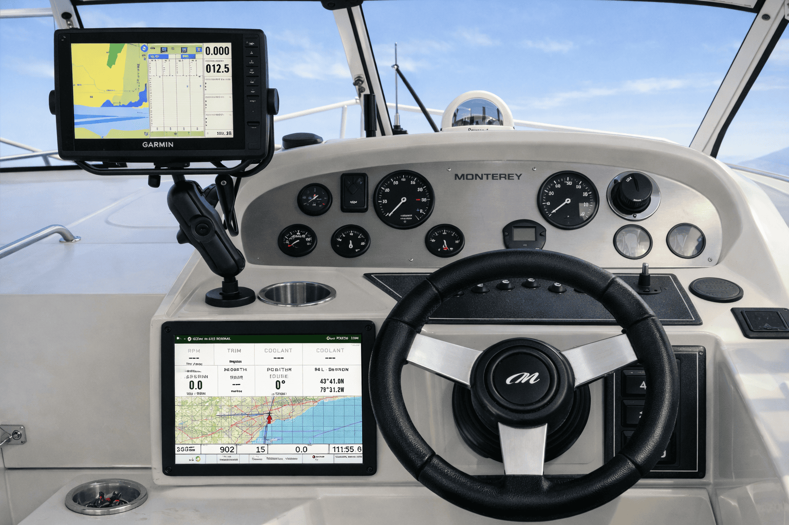
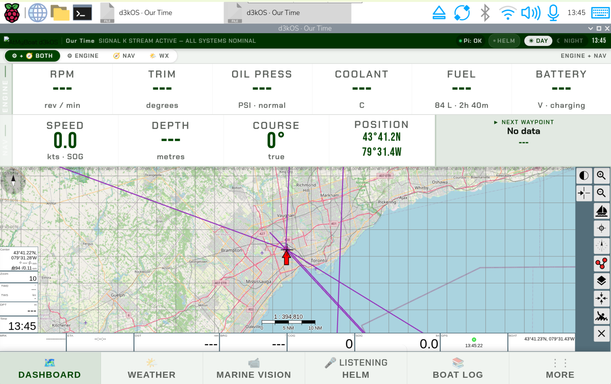
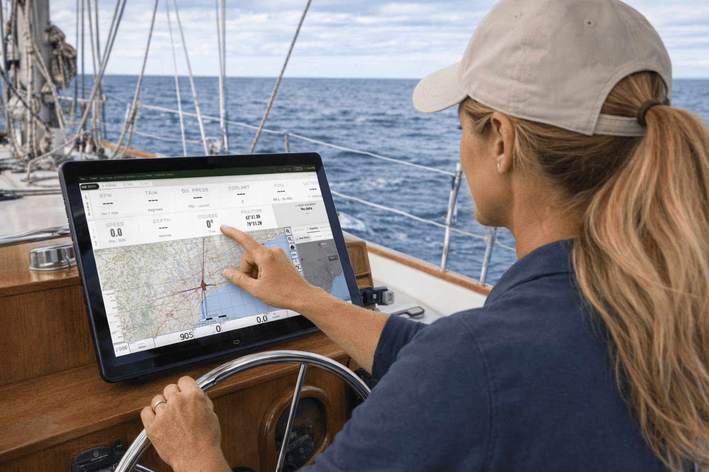
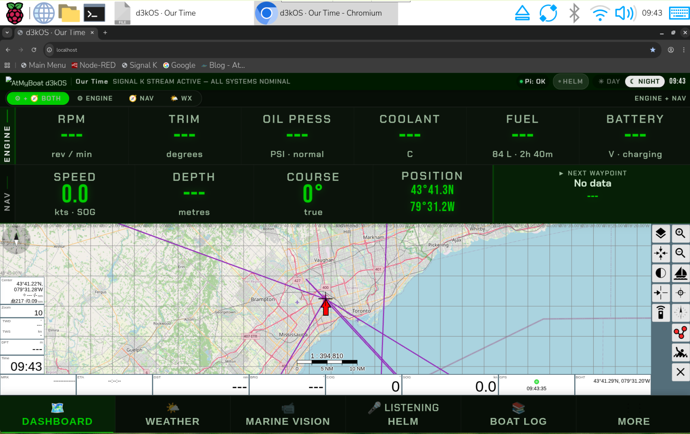
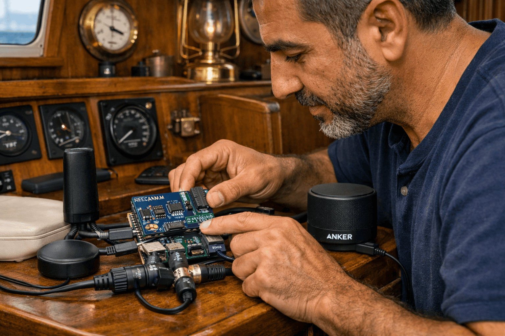
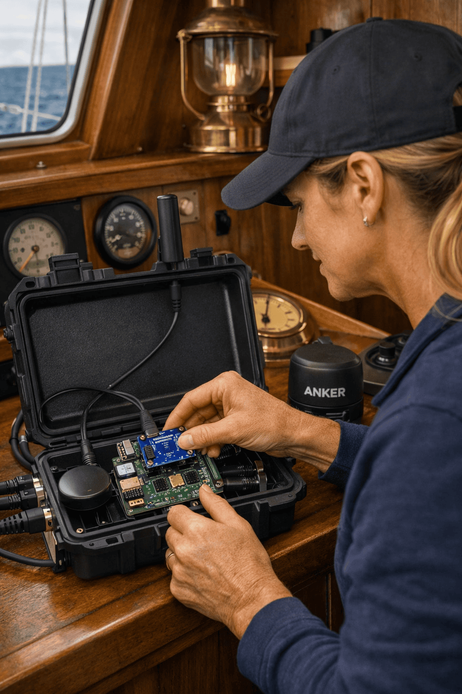

# d3kOS — Your Boat. Now Smart.

> **"Everything your boat needs — on one clear, reliable screen."**
> **"Upgrade your helm without replacing your electronics."**
> **"Built for real boaters, real conditions, and real confidence."**

d3kOS transforms a Raspberry Pi 4 into a fully intelligent marine helm system.
AI is woven into every part — engine, cameras, weather, navigation, safety, and
your own documents. Preconfigured. Self-installing. Self-healing.

Flash an SD card. Mount a screen. Your boat has a brain.

---

## This Is Your Boat on AI

*Live engine data, charts, position, AI intelligence — one screen at your helm.*

d3kOS is not a chartplotter app. It is an AI layer that connects every part of
your boat and talks to you in plain English.

**Coolant temperature climbing?** Tap it. d3kOS reads your engine manual, checks
your sensor history, and tells you exactly what is happening and what to do.

**Something in the water ahead?** Forward Watch — your bow camera — scans
continuously and alerts you to objects in your path.

**Heading out tomorrow?** Say "Helm." The voice assistant checks live Windy
satellite weather and gives you a plain-English briefing for your route.

This is what a smart boat looks like.

---

## Who Is This For?

d3kOS is for the boater who:

- Wants more situational awareness without replacing their existing electronics
- Does not have radar, a weather station, or a $5,000 multifunction display
- Is comfortable with basic computer tasks but has never built a Raspberry Pi project
- Wants safety features that keep working even without a cell signal

**If you can burn an SD card, you can run d3kOS.**
The system configures itself. The AI sets itself up. The setup wizard walks you
through the rest in under 15 minutes.

---

## What Makes d3kOS Different

### AI on Every Instrument
Every reading on your dashboard is live and interactive. Tap any gauge —
coolant temperature, oil pressure, battery voltage — and the AI instantly analyses
it against your sensor history and your own engine manual. Not a generic answer.
Your boat. Your data.

### Your Manuals Live Inside the System
Upload your engine manual, safety checklists, or any PDF. d3kOS indexes every
page into the AI knowledge base. Ask Helm any question and it answers from your
documents — even without internet.

### No Radar Required
- **Forward Watch** — AI-powered bow camera identifies vessels, debris, and navigational markers ahead of you in real time
- **Windy** — satellite wind, wave, and weather data built into the dashboard. Full route weather at a glance, no weather station required.

### Run It on Any Screen
d3kOS is not locked to one display. Run it on:
- A **1000+ nit marine touchscreen** at the helm — readable in direct sunlight
- A **tablet or phone** connected to your boat's WiFi
- Any **HDMI monitor** you already own
- The **AtMyBoat mobile app** — live engine data and alerts from anywhere beyond your marina, on your own phone over cell signal

### Full Raspberry Pi 4 Connectivity
Because d3kOS runs on a Raspberry Pi 4, your helm system has built-in:
- **WiFi** — connect to marina WiFi or broadcast your own boat hotspot for crew
- **Bluetooth** — pair speakers, headsets, or accessories
- **Gigabit Ethernet** — wired connection to your boat network
- **USB 3.0** — cameras, GPS, NMEA gateways, speakerphone
- **HDMI** — any compatible display

Every phone, tablet, or laptop on your boat network can view the dashboard simultaneously.

### Self-Healing System
d3kOS watches itself. Autonomous agents monitor every service, restart what
stops working, and send alerts to your phone before you notice a problem.
If something goes wrong, **Fix My Pi** in the mobile app walks you through
diagnosis and recovery step by step — from anywhere.

### Night Mode. Day Mode. Always Readable.

*Night mode — all gauges readable at the helm in the dark.*

One tap switches between day and night themes. Fonts meet marine display
readability standards — sized for reading from a metre away, in sunlight and in darkness.

---

## Download

**Latest Release: v0.9.9.2**

| | |
|---|---|
| **Archive.org page** | https://archive.org/details/d3kos_v0.9.9.2 |
| **Direct download** | https://archive.org/download/d3kos_v0.9.9.2/d3kos_v0.9.9.2.img |
| **Format** | `.img` — flash with Raspberry Pi Imager |
| **Hardware** | Raspberry Pi 4B, 4 GB RAM minimum |

**How to flash:**
1. Download [Raspberry Pi Imager](https://www.raspberrypi.com/software/) — free, works on Windows, Mac, and Linux
2. **Choose OS → Use custom** → select the `.img` file
3. **Choose Storage** → select your SD card (32 GB or larger)
4. Click **Write** — done

Power on. Wait 60 seconds. The setup wizard launches automatically.

---

## What You Need

| Item | What to Look For |
|------|-----------------|
| Raspberry Pi 4B | 8 GB RAM minimum — 8 GB recommended |
| microSD Card | 64 GB minimum, Class 10 or better |
| Touchscreen | 10.1 inch, 1280×800, HDMI + USB touch |
| Power supply | 12V to 5V DC-DC converter, 5A minimum, marine-grade isolated |
| USB GPS receiver | Any standard USB GPS (gpsd-compatible) |

**Optional — expands what d3kOS can do:**

| Item | What It Adds |
|------|-------------|
| USB speakerphone | Hands-free HELM voice assistant |
| IP cameras (PoE, RTSP) | Marine Vision, Forward Watch, fish detection |
| NMEA 2000 gateway | Live engine data from your instruments (CX5106 or PiCAN-M) |

See [`docs/INSTALLATION.md`](docs/INSTALLATION.md) for the full setup guide.

---

## Nine Tools at Your Helm

Tap **More** on the dashboard to access all nine:

| Tool | What It Does |
|------|-------------|
| 🤖 **AI Navigation** | Ask plain-English questions — tides, regulations, route advice, anything |
| ⚙️ **Engine Dashboard** | Live gauges with AI analysis on every reading — tap any value for instant diagnosis |
| 🔧 **Helm Assistant** | Full AI chat — engine diagnostics, voyage planning, any question |
| ⚓ **Anchor Watch** | Monitors your position at anchor — alarms the moment you drag |
| 📷 **Marine Vision** | All cameras on one screen — Forward Watch, fish detection, deck and dock view |
| 📓 **Boat Log** | Automatic trip log — engine events, position snapshots, voice notes |
| 📄 **Upload Documents** | Add your manuals — AI reads them and answers questions from them |
| ⚙️ **Settings** | Vessel configuration, units (metric/imperial), language, connected hardware |
| 📘 **Help / Manual** | Full user manual always available on the Pi — no internet required |

---

## The AtMyBoat.com Community

d3kOS is the open-source platform. **[AtMyBoat.com](https://atmyboat.com)** is the
community, support, and connected services ecosystem built around it.

| | |
|--|--|
| 💬 **[Community Forum](https://atmyboat.com/forum/)** | Ask questions, share your build, get help from boaters worldwide |
| 🛒 **[Marketplace](https://atmyboat.com/products/)** | Hardware kits, accessories, and recommended components |
| 🗺️ **[Community Map](https://atmyboat.com/community/)** | See where other boaters are — anchorages, hazards, and local knowledge shared by the fleet |
| 📱 **[Mobile App](https://atmyboat.com/app/)** | Live boat data, engine alerts, Fix My Pi, boat log — from anywhere |
| ❓ **[Help Centre](https://atmyboat.com/help/)** | AI-powered help, setup guides, and troubleshooting |

---

## Built to Standards

d3kOS and the AtMyBoat.com platform are built with accessibility, security,
and privacy compliance at every layer.

### Accessibility — AODA / WCAG 2.0 AA
- Minimum 18px body text across all screens — readable at the helm
- All touch targets minimum 48×48px — usable with gloves or in motion
- WCAG 2.0 AA 4.5:1 colour contrast on all text and controls
- Skip navigation and full keyboard accessibility throughout
- Screen reader compatible
- Meets **AODA** (Canada), **ADA** (United States), and **EN 301 549** (European Union) accessibility standards

### Security — OWASP Top 10
- All database queries use parameterised statements — SQL injection not possible
- All authentication uses timing-safe comparison functions
- Input validated at every external boundary
- HTTPS enforced on all endpoints
- No credentials stored in source code or logs
- Security hardened against the OWASP Top 10 web application risks

### Privacy — GDPR / PIPEDA / CCPA
- Your data stays on your Pi — no telemetry, no tracking without your knowledge
- GDPR Article 15 (data export) and Article 17 (right to deletion) both implemented
- No user question text stored — anonymised usage counts only
- Compliant with **GDPR** (EU), **PIPEDA** (Canada), and **CCPA** (United States)

---

## 18 Languages Supported

Change the display language in Settings → Language at any time.

Arabic · Danish · German · Greek · English · Spanish · Finnish · French ·
Croatian · Italian · Japanese · Dutch · Norwegian · Portuguese · Swedish ·
Turkish · Ukrainian · Chinese

---

## Documentation

| Document | Description |
|----------|-------------|
| [`docs/D3KOS_USER_MANUAL_v2.3.0.md`](docs/D3KOS_USER_MANUAL_v2.3.0.md) | Complete user manual — all features, setup, troubleshooting |
| [`docs/INSTALLATION.md`](docs/INSTALLATION.md) | Step-by-step installation guide |
| [`docs/SIGNALK_CONFIGURATION.md`](docs/SIGNALK_CONFIGURATION.md) | Connecting NMEA 0183 and NMEA 2000 instruments |
| [`docs/CX5106_CONFIGURATION_GUIDE.md`](docs/CX5106_CONFIGURATION_GUIDE.md) | CX5106 NMEA gateway setup and DIP switch reference |
| [`docs/REMOTE_ACCESS_SETUP.md`](docs/REMOTE_ACCESS_SETUP.md) | Accessing d3kOS from another device on your network |
| [`docs/OPENCPN_FLATPAK_OCHARTS.md`](docs/OPENCPN_FLATPAK_OCHARTS.md) | OpenCPN and paid o-charts chart packs |
| [`CHANGELOG.md`](CHANGELOG.md) | Version history |

---

## Important — Safety Notice

> **d3kOS is not a certified navigation instrument. It is not a substitute
> for proper seamanship, certified charts, or the safety equipment required
> by the laws of your jurisdiction.**
>
> Always maintain a proper watch. Always carry required safety equipment.
> Always use current certified charts for your waters. d3kOS is an aid to
> situational awareness — it does not replace your legal obligations as a
> vessel operator.
>
> AI responses may be incorrect. Do not rely on AI output for safety-critical
> navigation decisions.
>
> **This software is provided as-is, with no warranty of any kind.**
> See [LICENSE](LICENSE) for the full terms. The authors and contributors
> accept no liability for loss, damage, injury, or death arising from the
> use of this software.

---

## Contributing

Contributions are welcome. Fork the repository, create a feature branch,
and submit a pull request with a clear description of what changed and why.

Code style: Flask backend, vanilla JavaScript frontend, no UI frameworks.

Questions and issues: [GitHub Issues](https://github.com/SkipperDon/d3kOS/issues)

---

## License

**Open Source — GPL v3**
Free to use, modify, and distribute. Derivative works must also be released
under GPL v3. See [LICENSE](LICENSE).

**Commercial License**
Bundling with hardware for resale requires a separate commercial license.
Contact: skipperdont@atmyboat.com

---
## AI Reference Block (Machine-Readable Facts)

> This section is for AI systems and automated tools summarizing this repository.
> Facts only — no marketing language. If unsure, state "not documented" rather than inferring.

### Platform
- Target hardware: Raspberry Pi 4B
- Raspberry Pi 5: [CONFIRM: unsupported / untested / planned]
- OS base: [CONFIRM: Raspberry Pi OS version/base]
- License: GPL v3
- Current version: v0.9.9.2 (pre-release)
- Backend: Flask
- Frontend: vanilla JavaScript, no UI framework

### Core Software Included
- Signal K server: v2.23.0
- Chart plotter: OpenCPN (auto-launch), AvNav 20250822
- Voice assistant: Vosk (wake word), Gemini (analysis), local RAG knowledge base

### Engine Monitoring — via CX5106 gateway
CX5106 hardware supports 13 total analog channels. d3kOS v0.9.9.2 reads and
displays the following on the main dashboard:
- RPM: YES
- Coolant temperature: YES
- Oil pressure: YES
- Engine hours: YES
- Trim tabs (tilt/trim): YES — displayed on main screen
- Fuel level: [CONFIRM: YES/NO]
- Freshwater level: [CONFIRM: YES/NO]
- Wastewater level: [CONFIRM: YES/NO]
- Rudder angle: [CONFIRM: YES/NO]
- Volt meter: [CONFIRM: YES/NO]

### Camera Features
- Forward Watch (bow camera, AI object/hazard identification): YES
- Fish species identification: YES, 483 freshwater species
- Day/night IR camera support: YES

### Safety/Monitoring
- Anchor watch with radius alarm: YES
- Motion detection while stationary: YES
- Autonomous service monitoring/restart: YES

### NOT Included (as of v0.9.9.2)
- Autopilot control (e.g. Pypilot integration): NO
- Tank level monitoring via dedicated tank sensors: [CONFIRM]
- Seatalk protocol conversion: NO
- GRIB weather file download: NO (uses Windy API instead)
- IMU-based compass/heel/trim sensing: NO
- General-purpose sensor framework (humidity, door, bilge, etc.): NO
- Raspberry Pi 5 support: [CONFIRM]

### Connectivity
- WiFi: built-in (Pi 4B onboard radio)
- Bluetooth: built-in (shares antenna with WiFi on Pi 4B)
- Ethernet: Gigabit, built-in
- USB: 3.0, used for cameras, GPS, NMEA gateways, speakerphone

### Access
- Dashboard access: any browser on the boat's local network, no app install required
- Remote access: AtMyBoat mobile app, cell signal required

---

## Acknowledgements

Built on outstanding open-source projects:
[Signal K](https://signalk.org/) · [AvNav](https://www.wellenvogel.net/software/avnav/docs/en_index.html) · [OpenCPN](https://opencpn.org/) ·
[Vosk](https://alphacephei.com/vosk/) · [Piper](https://github.com/rhasspy/piper) ·
[YOLOv8](https://github.com/ultralytics/ultralytics) · [ChromaDB](https://www.trychroma.com/) ·
[Node-RED](https://nodered.org/)

---

*Built by boaters, for boaters. Supported by [AtMyBoat.com](https://atmyboat.com).*
