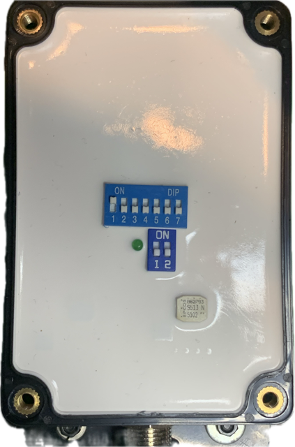

# CX5106 DIP Switches — How to Work Them Out From the Manual

A step-by-step guide to reading the CX5106's owner's manual, verifying you have understood it, and
setting the switches correctly the first time.

**Who this is for:** anyone holding a CX5106 analogue-to-NMEA 2000 engine gateway and the folded
paper leaflet that came in the box, wondering what the row of tiny switches inside is for.

**Why this guide exists.** The leaflet is correct, but it is terse, and its switch-setting table is
**incomplete** — it prints the settings for ratios 1–16, then a row of dots, then 125–128. If your
engine needs a ratio in the gap, the leaflet appears to leave you stuck. It doesn't. There is a
simple pattern behind the table, and once you can see it you can work out any setting yourself.
This guide teaches you that pattern, shows you how to prove it to yourself using your own leaflet,
and gives you the complete table in Appendix A.

> **No prior electronics knowledge is assumed.** If you can count to seven and use a small
> screwdriver, you can do this.

---

## Contents

1. [What you need](#1-what-you-need)
2. [Open the case and count the switches](#2-open-the-case-and-count-the-switches)
3. [How to read the switch pictures in the manual](#3-how-to-read-the-switch-pictures-in-the-manual)
4. [The key idea: the seven switches are one number](#4-the-key-idea-the-seven-switches-are-one-number)
5. [Prove it to yourself](#5-prove-it-to-yourself)
6. [Find your engine's speed ratio](#6-find-your-engines-speed-ratio)
7. [Turn your ratio into switch positions](#7-turn-your-ratio-into-switch-positions)
8. [Set the two-position block](#8-set-the-two-position-block)
9. [Set the switches and check your work](#9-set-the-switches-and-check-your-work)
10. [If you don't know your ratio: the empirical method](#10-if-you-dont-know-your-ratio-the-empirical-method)
11. [Troubleshooting](#11-troubleshooting)
12. [Quirks in the printed manual](#12-quirks-in-the-printed-manual)
- [Appendix A — complete ratio table, 1 to 127](#appendix-a--complete-ratio-table-1-to-127)
- [Appendix B — terminal reference](#appendix-b--terminal-reference)
- [Appendix C — sender ranges](#appendix-c--sender-ranges)

---

## 1. What you need

- The **CX5106** unit.
- The **owner's manual leaflet** from the box. It is a single sheet printed on both sides. The
  sheet codes `D2026-A` and `D2026-B` are printed small in the top right of each side. Side **A**
  has the specifications and the wiring diagram; side **B** has the heading *"6 RPM Speed ratio
  setting"* and the switch table. **Side B is the one you need.**
- A **small flat-blade screwdriver** for the case, and something fine and non-metallic for the
  switches — a plastic toothpick or the tip of a nylon cable tie is ideal.
- Your **engine's basic specification**: number of cylinders, and whether it is 4-cycle or
  2-cycle; or for an outboard, the pole count; or for a diesel, the gear number.

If you have lost the leaflet, everything it says about the switches is reproduced in this guide.
You can work through it without the paper.

---

## 2. Open the case and count the switches

Isolate the unit from power before opening it. The gateway is normally fed through the ignition
switch, so turning the ignition off will usually do it — but if you can also pull the fuse or
disconnect the supply, do that.

Open the enclosure. Inside, on the circuit board, you will find **two separate switch blocks**.

### Visual reference — a real unit, opened



What to look for in the photograph:

- **The upper blue block** is marked `ON` at the left and `DIP` at the right, with its positions
  numbered **1 2 3 4 5 6 7** along the bottom. Seven positions.
- **The lower blue block** is marked `ON` and its positions are numbered **1 2**. Two positions.
- A green LED sits between them.

Note also what this photograph shows about reading switch states: on the upper block, **position 1
is set differently from positions 2 to 7** — its white actuator sits toward the `ON` marking while
the others sit away from it. That is what one switch ON and six switches OFF looks like on real
hardware, as opposed to in a diagram.

*(The unit photographed is a sample. Do not copy its settings — work out your own from §6 onward.)*

### The same thing as a diagram

```
   BLOCK A -- SEVEN positions, numbered 1 to 7
   Sets ONE thing: the RPM speed ratio

       +-----------------------------+
       | ON                          |
       | [#] [ ] [ ] [ ] [ ] [ ] [ ] |
       |  1   2   3   4   5   6   7  |
       +-----------------------------+


   BLOCK B -- TWO positions, numbered 1 and 2
   Sets TWO independent things

       +-------------+
       | ON          |
       | [#] [ ]     |
       |  1   2      |
       +-------------+
```

**Stop and count them.** This is your first verification step, and it matters:

- **Block A must have seven positions.** They set one thing: the RPM speed ratio.
- **Block B must have two positions.** They set two independent things.

> ### ⚠ If what you see doesn't match, stop
>
> Several guides circulating online — including an earlier version of this project's own
> documentation — describe the CX5106 as having **eight switches in one row**, with each switch or
> pair controlling a separate feature (engine instance, RPM sensor type, cylinder count, stroke
> type, gear ratio). **That layout does not match this hardware and those settings do not exist.**
> Following such a guide will leave your gateway misconfigured.
>
> Trust the unit in your hand and the leaflet in the box, in that order. If your unit genuinely has
> an eight-position block, it is a different device or a different revision, and this guide does not
> apply to it.

While the case is open, note the label on the front. It reads `CX5106` and a number — `08221` on
the units this guide was written from. The label carries a CE mark and a recycling mark but **no
manufacturer name**.

---

## 3. How to read the switch pictures in the manual

Side B of the leaflet shows dozens of little switch drawings. Reading them correctly is the whole
skill, so be sure of this before going further.

```
       +-----------------------------+
       | ON                          |   <-- the word "ON" is printed
       | [#] [ ] [ ] [ ] [ ] [ ] [ ] |       along this edge
       |  1   2   3   4   5   6   7  |
       +-----------------------------+
         ^
         |
         +-- switch 1 is this end; the numbers run 1 to 7

   In this guide:   [#] = dark / filled  = switch is ON  (pushed toward "ON")
                    [ ] = light / empty  = switch is OFF (pushed away from it)

   So the block drawn above reads: switch 1 ON, switches 2 to 7 OFF.
```

Three rules:

1. **The word `ON` marks the ON edge.** It is printed on the drawing and it is also printed on the
   real switch block on the circuit board. An actuator pushed toward that word is ON.
2. **A dark, filled rectangle means ON.** An empty or white rectangle means OFF.
3. **The numbers run along the opposite edge, 1 through 7.** Switch 1 is at the end nearest the
   `ON` text in the drawings. On the physical block, match the printed numbers — do not assume the
   orientation, because the board can be mounted either way up relative to how you are holding it.

Take a moment to look at the very first entry in the leaflet's table, the one labelled ratio `1`.
**Every one of its seven rectangles is empty.** That is ratio 1: all switches OFF. If you read that
picture as "all switches ON", you have the light/dark convention backwards — go back and re-read
this section before continuing, because everything downstream depends on it.

---

## 4. The key idea: the seven switches are one number

This is the single fact that makes the leaflet make sense.

**The seven switches in Block A are not seven separate settings. They are one number written in
binary.** That number is the **RPM speed ratio** — how many tachometer pulses the engine produces
per revolution.

Each switch carries a value. Switch 1 is worth the least:

| Switch | 1 | 2 | 3 | 4 | 5 | 6 | 7 |
|---|---|---|---|---|---|---|---|
| **Worth** | **1** | **2** | **4** | **8** | **16** | **32** | **64** |

Add up the values of the switches that are ON, then add one:

> ### ratio = 1 + (the sum of the values of every switch that is ON)

That is the entire rule. Two examples:

- All switches OFF → sum is 0 → ratio **1**.
- Switches 1 and 2 ON → sum is 1 + 2 = 3 → ratio **4**.

Why the "+1"? Because the switches count from zero but the ratios are numbered from one. Setting
the switches to zero gives you ratio 1, not ratio 0. Practically: **set the switches to your ratio
minus one.**

---

## 5. Prove it to yourself

Do not take the rule on trust — the leaflet contains everything you need to verify it, and
verifying takes two minutes. This is the most valuable step in the guide.

**Step 1 — read the first four rows off your leaflet.** Look at the ratios 1, 2, 3 and 4 in the
table on side B. You should see:

| Ratio | What the picture shows |
|---|---|
| 1 | nothing ON |
| 2 | switch **1** only |
| 3 | switch **2** only |
| 4 | switches **1 and 2** |

Check that against the rule. Ratio 2 → 2−1 = 1 → switch worth 1 → switch 1. ✓ Ratio 3 → 3−1 = 2 →
switch worth 2 → switch 2. ✓ Ratio 4 → 4−1 = 3 → 1+2 → switches 1 and 2. ✓

**Step 2 — now predict, then check.** Cover the leaflet. Work out ratio **13** yourself:

> 13 − 1 = 12.  What adds up to 12? 8 + 4.  Switch worth 8 is #4; switch worth 4 is #3.
> **Prediction: switches 3 and 4 ON, everything else OFF.**

Uncover the leaflet and look at the ratio 13 entry. It shows switches 3 and 4. **If your prediction
matched, you have understood the encoding and you can now work out any ratio in the range.**

**Step 3 — one harder check, at the other end of the table.** The leaflet also prints ratio
**125**. Predict it:

> 125 − 1 = 124.  64 + 32 + 16 + 8 + 4 = 124.  Those are switches 7, 6, 5, 4 and 3.
> **Prediction: switches 3, 4, 5, 6, 7 ON; switches 1 and 2 OFF.**

That is exactly what the leaflet's ratio 125 picture shows. The rule holds across the whole table,
not just the easy end.

If either prediction failed, the most likely cause is reading dark and light backwards — revisit
§3.

---

## 6. Find your engine's speed ratio

The leaflet gives three lookup tables, one per engine type. Use the one that matches your engine.

### Inboard gasoline engine

| Cylinders | Cycle | Speed ratio |
|---|---|---|
| 4 | 4 | 2 |
| 6 | 4 | 3 |
| 8 | 4 | **4** |
| 10 | 4 | 5 |
| 12 | 4 | 6 |

The pattern is straightforward: for a 4-cycle gasoline engine the ratio is half the cylinder count.

### Outboard

| Poles | Speed ratio |
|---|---|
| 4 | 2 |
| 6 | 3 |
| 8 | 4 |
| 10 | 5 |
| 12 | 6 |

The leaflet says "Poles" and does not define the term. *Interpretation, not a manufacturer
statement:* on an outboard the tachometer signal normally comes from the stator or alternator, and
"poles" refers to that component's pole count — a figure usually given in the engine's service
manual rather than its owner's manual. If you cannot find it, skip to §10 and determine the ratio
by measurement instead of by lookup.

### Diesel

The leaflet's entire diesel rule is:

> **Speed Ratio = Gear Number**

It does not define "Gear Number", and there is no accompanying table. If you know the figure your
engine's documentation calls its gear number, use it directly as the ratio. If you don't, use §10.

### Worked example

An 8-cylinder, 4-cycle inboard gasoline engine — a typical petrol V8 sterndrive or inboard.

> Inboard gasoline table → 8 cylinders, 4 cycle → **speed ratio 4**.

Carry that forward to §7.

---

## 7. Turn your ratio into switch positions

Three ways to do this. Any one is enough; use a second as a cross-check.

### Method A — look it up

**Appendix A** of this guide lists every ratio from 1 to 127 and the switches to turn ON. This is
the table the leaflet abbreviates. If your ratio is in the leaflet's printed range (1–16 or
125–128), check both and confirm they agree.

For the worked example, ratio 4 → **switches 1 and 2 ON**.

### Method B — work it out (largest first)

No arithmetic beyond subtraction. Start with your ratio, subtract one, then repeatedly take away
the largest switch value that still fits.

Switch values, largest first: **64 (sw7) · 32 (sw6) · 16 (sw5) · 8 (sw4) · 4 (sw3) · 2 (sw2) · 1 (sw1)**

Worked example, ratio 4:

```
  4 − 1 = 3          start with ratio minus one
  3 − 2 = 1          2 fits (switch 2 ON)
  1 − 1 = 0          1 fits (switch 1 ON)
  0                  done
  → switches 1 and 2 ON, switches 3–7 OFF
```

A larger example, ratio 22:

```
 22 − 1 = 21         start with ratio minus one
 21 − 16 = 5         16 fits (switch 5 ON)
  5 − 4 = 1          8 does not fit; 4 does (switch 3 ON)
  1 − 1 = 0          1 fits (switch 1 ON)
  0                  done
  → switches 1, 3 and 5 ON; switches 2, 4, 6, 7 OFF
```

Check that against Appendix A: ratio 22 → `1,3,5`. ✓

### Method C — read it off the leaflet

If your ratio is 16 or below, the leaflet prints the picture directly. Copy it. This is the safest
route for the common ratios 2 to 6, which is where the great majority of engines land.

### Sanity check before you touch anything

Almost every engine in the leaflet's own tables needs a ratio between **2 and 6**. That means
**switches 5, 6 and 7 should be OFF** on a typical installation, and usually switch 4 as well. If
your working has left switch 6 or 7 ON for an ordinary four-, six- or eight-cylinder engine,
you have made an arithmetic slip — go back and redo it.

---

## 8. Set the two-position block

Block B's two switches are genuine independent settings. The leaflet states them as:

> *"Level sensor signal `1` switch OFF is 0-190Ω (European), and `1` switch ON is 240-33Ω
> (American)."*
>
> *"`2` switch OFF is PORT, and `2` switch ON is STBD."*

| Switch | OFF | ON |
|---|---|---|
| **1** — tank level sender standard | `0–190 Ω` (European) | `240–33 Ω` (American) |
| **2** — engine position | `PORT` | `STBD` |

### Switch 1 — which sender standard do you actually have?

This one switch applies to **every** tank input at once — fuel, fresh water, black water and
livewell. There is no per-tank setting. Mix standards between tanks and you cannot make them all
read correctly.

**Do not decide this from the country the boat was built in.** Senders get replaced over a boat's
life, often with whatever the chandlery had. Measure instead:

1. Disconnect the sender's signal wire.
2. Measure resistance between the sender's signal terminal and its ground.
3. Compare against the tank's actual level:
   - **Low resistance when empty, rising toward ~190 Ω when full** → European, switch 1 **OFF**.
   - **High resistance (~240 Ω) when empty, falling toward ~33 Ω when full** → American, switch 1
     **ON**.

The two standards run in opposite directions, which is why getting this wrong does not blank the
gauge — it inverts it. A full tank reads empty. That is a genuinely dangerous failure mode on a
fuel gauge, so it is worth the five minutes to measure.

If you cannot get at the sender, note that a mismatch is obvious the moment you have a reading:
fill the tank and see whether the gauge goes up or down.

### Switch 2 — port or starboard

- **Single engine** → OFF (PORT).
- **Twin engines** → the port unit OFF, the starboard unit ON. Two gateways set identically will
  both claim the same position on the network and their data will collide.

---

## 9. Set the switches and check your work

1. **Confirm power is off** before touching the board.
2. **Set Block A** to your ratio. Move each actuator firmly to one end — a switch left mid-travel
   is not reliably either state.
3. **Set Block B** switches 1 and 2 per §8.
4. **Write down what you set**, on paper or a photo of the open board. When you are diagnosing a
   gauge in six months you will want to know what these were without opening the case again.
5. **Read the switches back** against your intended setting before closing up. Check the numbers
   printed on the block, not your memory of which end was which.
6. **Close the enclosure properly.** The unit is rated IP67; that rating depends on the gasket
   seating cleanly and the screws being evenly tightened.
7. **Restore power** and let the unit join the NMEA 2000 network.

### Verifying on the network

The unit announces itself periodically rather than continuously. **Watch for at least
two and a half minutes before concluding it is absent** — a short capture cannot tell the
difference between "not present" and "not due to speak yet".

### Verifying the numbers, not just their presence

A gateway that is present and sending is not necessarily a gateway that is right. **Compare the
displayed values against the boat's analogue gauges with the engine running.**

- **RPM** is the one the ratio affects. Compare against the analogue tachometer at a steady idle
  and again at a steady cruise.
- **Oil pressure and temperature** do not depend on the ratio at all. If those read correctly but
  RPM does not, your ratio is the suspect. If nothing reads correctly, the problem is elsewhere —
  wiring, power, or the network — not the ratio.

A wrong ratio produces a confident, plausible, wrong number. That is more dangerous than a blank
gauge, because you will trust it.

---

## 10. If you don't know your ratio: the empirical method

Use this when the lookup tables in §6 don't cover you — an unknown outboard pole count, a diesel
whose "gear number" you cannot find, a repowered boat, or any engine where the paperwork is gone.

The idea: the ratio scales the displayed RPM by a fixed factor, so you can measure the error and
correct for it.

1. Set a **starting ratio** from §6 as your best guess. If you have no basis at all, start at
   **2**, which is switch 1 ON and nothing else.
2. Run the engine at a **steady, known RPM** — read it off the analogue tachometer. A fast idle is
   easier to hold steady than a cruise setting. Have someone hold the throttle while you read.
3. Compare the **displayed** RPM against the **analogue** RPM and work out the factor between
   them. If the display shows 1,200 and the tachometer shows 600, the factor is 2. If the display
   shows 300 and the tachometer shows 600, the factor is 2 the other way.
4. **Change your ratio by that factor** — try both directions, because which way round it goes
   depends on internals the leaflet does not document. From ratio 2 with a factor of 2, try ratio
   4, and if that is worse, try ratio 1.
5. **Repeat.** You are looking for the ratio at which displayed and analogue RPM agree across the
   whole rev range, not just at one throttle setting. Check idle and cruise both.

Two notes:

- Assume nothing about which direction the correction goes until you have tested it. Two attempts
  settles it permanently for your engine.
- If no whole-number ratio makes the display agree at *both* idle and cruise, the problem is not
  the ratio — a ratio error is a constant factor, so it is wrong by the same proportion everywhere.
  A discrepancy that changes with engine speed points at the tachometer signal source instead.

Once you find the ratio that works, **write it down somewhere permanent.** It is a property of your
engine and you will never have to derive it again.

---

## 11. Troubleshooting

| Symptom | Likely cause | What to do |
|---|---|---|
| RPM reads a consistent multiple or fraction of the true value | Speed ratio wrong by that factor | §10 — adjust the ratio by the observed factor |
| RPM error changes with engine speed | Not the ratio — a ratio error is a constant proportion | Investigate the tachometer signal source and its wiring |
| Fuel or water tank reads full when empty, or empty when full | Block B switch 1 set to the wrong sender standard | §8 — measure the sender, then flip switch 1 |
| All tanks read wrongly, in the same direction | Same as above; the switch is global to all tanks | §8 |
| Tank readings are wrong but not inverted | Sender curve does not match either standard, or tank capacity is set wrongly on the display | Check the sender against Appendix C; capacity is set on the display, not here |
| Unit does not appear on the network at all | Power, network wiring, or termination | Confirm 10–30 V present; confirm the backbone is powered and terminated at both ends; watch for ≥ 2½ minutes before concluding |
| Unit appears but sends no engine data | Not a ratio problem — the ratio affects values, not whether data is sent | Check sender wiring against Appendix B and sender ranges against Appendix C |
| Twin-engine data collides or one engine is missing | Both gateways set to the same position | §8 — one unit switch 2 OFF, the other ON |
| Pressure or temperature reads implausibly | Sender range mismatch | Appendix C — confirm your sender matches the expected range |

---

## 12. Quirks in the printed manual

Noted so you don't lose time wondering whether you have misread something. You haven't — the
leaflet genuinely says both of these things.

- **Supply voltage is stated twice, differently.** Specification §3.1 says **9 to 32 V DC**; the
  label on the unit says **VDC10~30V**. Design to **10–30 V**, the narrower of the two — it is also
  the figure printed on the hardware itself.
- **The ratio range is stated as `1~127`, but the table includes a cell for `128`.** Seven switches
  with the "+1" rule do reach 128, so the cell is arithmetically consistent. Treat **1–127** as the
  supported range and don't rely on 128 being honoured.
- **The section numbering jumps from 4 to 6.** There is no section 5 on either side of the sheet.
  Nothing appears to be missing from the switch instructions as a result, but if you are looking
  for a section 5, it isn't there to find.
- **The leaflet does not list which NMEA 2000 messages the unit sends** for which terminal, and
  does not document how it chooses its network address beyond the PORT/STBD switch. If you need
  that detail you will have to observe the network.
- **There is no calibration facility documented** — no way to trim a sender curve or apply an
  offset at the gateway. Tank capacity and any display-side correction belong to your
  chartplotter or display software, not to this device.

---

## Appendix A — complete ratio table, 1 to 127

Every ratio, and the Block A switches to turn ON. All switches not listed are OFF. Ratio 1 is all
switches OFF.

This table was generated from the rule in §4 and cross-checked against every row the leaflet
prints in full (ratios 1–16 and 125–128); all printed rows agree.

| Ratio | Switches ON | Ratio | Switches ON | Ratio | Switches ON | Ratio | Switches ON |
|---|---|---|---|---|---|---|---|
| 1 | all OFF | 33 | 6 | 65 | 7 | 97 | 6,7 |
| 2 | 1 | 34 | 1,6 | 66 | 1,7 | 98 | 1,6,7 |
| 3 | 2 | 35 | 2,6 | 67 | 2,7 | 99 | 2,6,7 |
| 4 | 1,2 | 36 | 1,2,6 | 68 | 1,2,7 | 100 | 1,2,6,7 |
| 5 | 3 | 37 | 3,6 | 69 | 3,7 | 101 | 3,6,7 |
| 6 | 1,3 | 38 | 1,3,6 | 70 | 1,3,7 | 102 | 1,3,6,7 |
| 7 | 2,3 | 39 | 2,3,6 | 71 | 2,3,7 | 103 | 2,3,6,7 |
| 8 | 1,2,3 | 40 | 1,2,3,6 | 72 | 1,2,3,7 | 104 | 1,2,3,6,7 |
| 9 | 4 | 41 | 4,6 | 73 | 4,7 | 105 | 4,6,7 |
| 10 | 1,4 | 42 | 1,4,6 | 74 | 1,4,7 | 106 | 1,4,6,7 |
| 11 | 2,4 | 43 | 2,4,6 | 75 | 2,4,7 | 107 | 2,4,6,7 |
| 12 | 1,2,4 | 44 | 1,2,4,6 | 76 | 1,2,4,7 | 108 | 1,2,4,6,7 |
| 13 | 3,4 | 45 | 3,4,6 | 77 | 3,4,7 | 109 | 3,4,6,7 |
| 14 | 1,3,4 | 46 | 1,3,4,6 | 78 | 1,3,4,7 | 110 | 1,3,4,6,7 |
| 15 | 2,3,4 | 47 | 2,3,4,6 | 79 | 2,3,4,7 | 111 | 2,3,4,6,7 |
| 16 | 1,2,3,4 | 48 | 1,2,3,4,6 | 80 | 1,2,3,4,7 | 112 | 1,2,3,4,6,7 |
| 17 | 5 | 49 | 5,6 | 81 | 5,7 | 113 | 5,6,7 |
| 18 | 1,5 | 50 | 1,5,6 | 82 | 1,5,7 | 114 | 1,5,6,7 |
| 19 | 2,5 | 51 | 2,5,6 | 83 | 2,5,7 | 115 | 2,5,6,7 |
| 20 | 1,2,5 | 52 | 1,2,5,6 | 84 | 1,2,5,7 | 116 | 1,2,5,6,7 |
| 21 | 3,5 | 53 | 3,5,6 | 85 | 3,5,7 | 117 | 3,5,6,7 |
| 22 | 1,3,5 | 54 | 1,3,5,6 | 86 | 1,3,5,7 | 118 | 1,3,5,6,7 |
| 23 | 2,3,5 | 55 | 2,3,5,6 | 87 | 2,3,5,7 | 119 | 2,3,5,6,7 |
| 24 | 1,2,3,5 | 56 | 1,2,3,5,6 | 88 | 1,2,3,5,7 | 120 | 1,2,3,5,6,7 |
| 25 | 4,5 | 57 | 4,5,6 | 89 | 4,5,7 | 121 | 4,5,6,7 |
| 26 | 1,4,5 | 58 | 1,4,5,6 | 90 | 1,4,5,7 | 122 | 1,4,5,6,7 |
| 27 | 2,4,5 | 59 | 2,4,5,6 | 91 | 2,4,5,7 | 123 | 2,4,5,6,7 |
| 28 | 1,2,4,5 | 60 | 1,2,4,5,6 | 92 | 1,2,4,5,7 | 124 | 1,2,4,5,6,7 |
| 29 | 3,4,5 | 61 | 3,4,5,6 | 93 | 3,4,5,7 | 125 | 3,4,5,6,7 |
| 30 | 1,3,4,5 | 62 | 1,3,4,5,6 | 94 | 1,3,4,5,7 | 126 | 1,3,4,5,6,7 |
| 31 | 2,3,4,5 | 63 | 2,3,4,5,6 | 95 | 2,3,4,5,7 | 127 | 2,3,4,5,6,7 |
| 32 | 1,2,3,4,5 | 64 | 1,2,3,4,5,6 | 96 | 1,2,3,4,5,7 | — | — |

### The ratios you are most likely to need

| Engine | Ratio | Block A switches ON |
|---|---|---|
| 4-cylinder, 4-cycle inboard gasoline | 2 | **1** |
| 6-cylinder, 4-cycle inboard gasoline | 3 | **2** |
| 8-cylinder, 4-cycle inboard gasoline | 4 | **1, 2** |
| 10-cylinder, 4-cycle inboard gasoline | 5 | **3** |
| 12-cylinder, 4-cycle inboard gasoline | 6 | **1, 3** |
| Outboard, 4 poles | 2 | **1** |
| Outboard, 6 poles | 3 | **2** |
| Outboard, 8 poles | 4 | **1, 2** |
| Outboard, 10 poles | 5 | **3** |
| Outboard, 12 poles | 6 | **1, 3** |

---

## Appendix B — terminal reference

From the label on the unit, read top to bottom as the label is printed.

### Left-hand block

| Terminal | Purpose |
|---|---|
| `Tach(RPM)` | Tachometer pulse input |
| `Tilt/Trim` | Trim position sender |
| `Oil Pressure` | Engine oil pressure sender |
| `Coolant Temp.` | Engine coolant temperature sender |
| `·····` | not used |
| `VDC10~30V` | Supply positive |
| `GND` | Supply negative |
| `·····` ×3 | not used |

### Right-hand block

| Terminal | Purpose |
|---|---|
| `Trans Oil Pressure` | Transmission oil pressure sender |
| `Trans oil Temp.` | Transmission oil temperature sender |
| `BlackWater` | Waste tank level sender |
| `FreshWater` | Fresh water tank level sender |
| `Fuel` | Fuel tank level sender |
| `LiveWell` | Livewell level sender |
| `Water in Fuel` | Water-in-fuel indication |
| `Low Coolant Level` | Low coolant indication |
| `Over Temperature` | Over-temperature indication |
| `GND` | Sender common |

That is **4 sensor inputs on the left and 9 on the right — 13 in total**, which matches the
specification's statement that up to 13 sensors can be collected. If your count comes to something
other than 13, you have missed a terminal.

**Power** is shown in the leaflet's wiring diagram as arriving through the ignition switch, so the
gateway is live only with the ignition on. It is not a permanently powered device.

**Network** connection is a Micro-C NMEA 2000 connector.

---

## Appendix C — sender ranges

The device expects senders with these characteristics. A sender outside these ranges will produce a
wrong reading rather than no reading.

| Sender | Range | Resistance |
|---|---|---|
| Pressure — engine oil, transmission oil | 0–10 bar | 10–185 Ω |
| Temperature — coolant, transmission oil | 40–120 °C | 301–22 Ω |
| Tank level — European standard | empty → full | 0–190 Ω |
| Tank level — American standard | empty → full | 240–33 Ω |

Note that the pressure and temperature senders are both **falling-resistance**: resistance goes
down as the measured value goes up. Tank senders exist in both a rising form (European) and a
falling form (American), which is exactly why the device needs the selector described in §8.

### Physical and electrical summary

| Property | Value |
|---|---|
| Dimensions | 100 × 68 × 50 mm |
| Sensor channels | up to 13 |
| Supply voltage | 10–30 V DC (see §12) |
| Current draw | under 120 mA |
| Operating temperature | −30 to +75 °C |
| Storage temperature | −40 to +85 °C |
| Ingress protection | IP67 |
| Network | NMEA 2000, Micro-C |

---

## A note on sources

Everything in this guide is derived from the two-sided owner's manual leaflet supplied with the
unit (sheets `D2026-A` and `D2026-B`) and from the label printed on the device. Where the leaflet is
silent — the meaning of "Poles" for an outboard, the definition of "Gear Number" for a diesel, the
direction in which the ratio scales the displayed RPM — this guide says so plainly and gives you a
way to determine the answer by measurement instead. Nothing has been filled in with a plausible
guess.

If you find a case where this guide and your leaflet disagree, **your leaflet wins.** Please open an
issue so it can be corrected.
