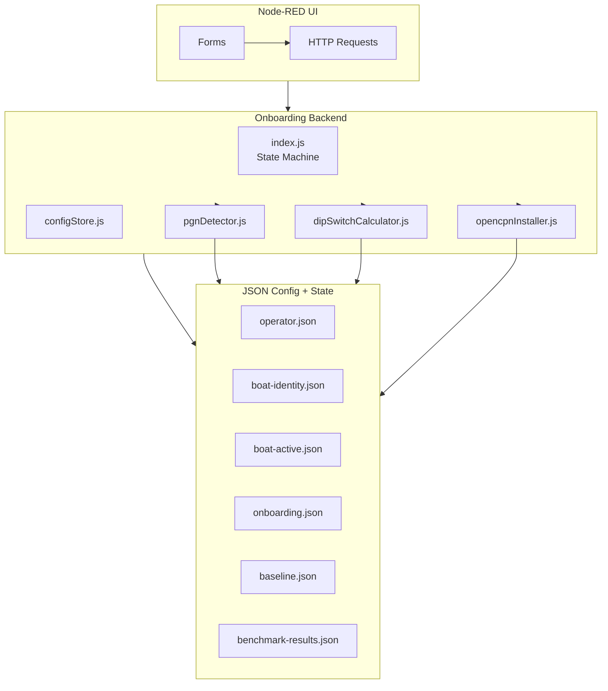
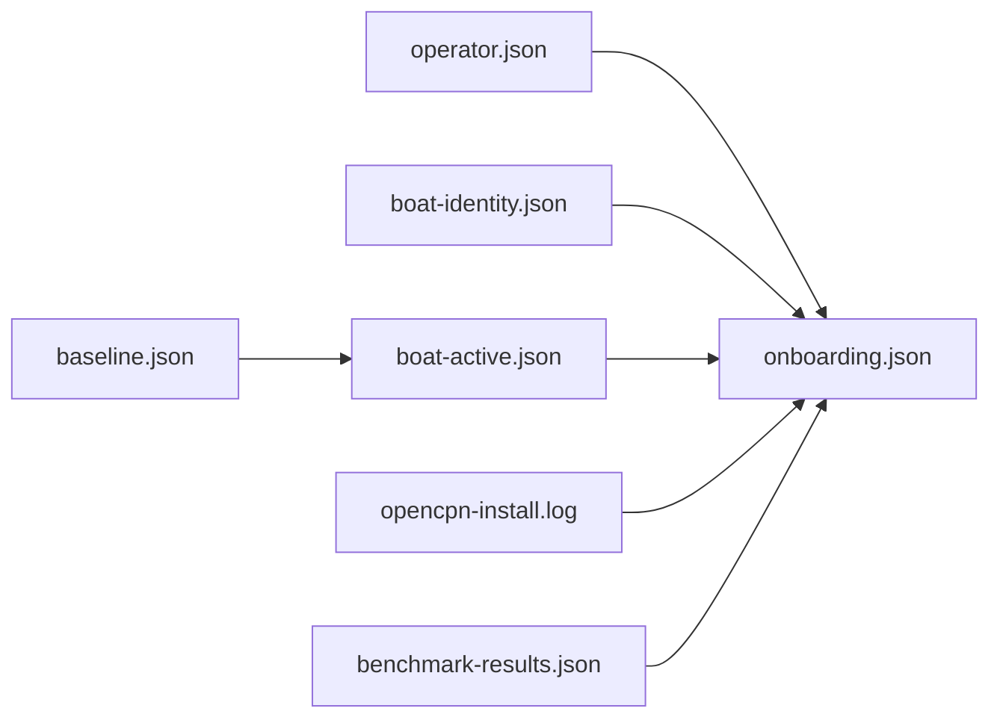
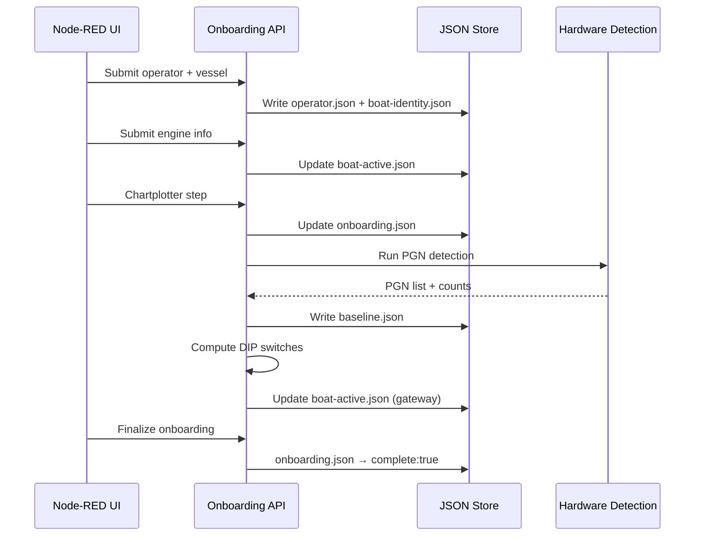

# **helm‑OS Tier‑0 — DATA MODEL**

### *Authoritative data structures, JSON schemas, and relationships for onboarding, detection, and runtime configuration*

---

# **1. Overview**

helm‑OS uses a **JSON‑based configuration model**.  
Every onboarding step writes to one or more JSON files, and every runtime service reads from them.

The data model is intentionally:

- **Flat** (no databases)  
- **Deterministic** (same inputs → same outputs)  
- **Human‑readable**  
- **Version‑controllable**  
- **Safe under power loss**  

---

# **2. High‑Level Data Model Diagram**

```mermaid
erDiagram

    OPERATOR {
        string alias
        string email optional
    }

    BOAT_IDENTITY {
        string name
        string type
        number length optional
        number beam optional
        number draft optional
    }

    BOAT_ACTIVE {
        string manufacturer
        string model
        number engine_count
        json gateway
        json sensors optional
    }

    ONBOARDING_STATE {
        string step
        boolean complete
        json data
    }

    BASELINE {
        number[] pgns
        json counts
    }

    OCPN_STATUS {
        boolean installed
        string log_path
    }

    BENCHMARK_RESULTS {
        json engine_curves
        json anomalies
        string timestamp
    }

    %% Relationships
    OPERATOR ||--|| ONBOARDING_STATE : "collected in"
    BOAT_IDENTITY ||--|| ONBOARDING_STATE : "collected in"
    BOAT_ACTIVE ||--|| ONBOARDING_STATE : "collected in"

    BASELINE ||--|| BOAT_ACTIVE : "PGN detection informs engine + gateway"
    OCPN_STATUS ||--|| ONBOARDING_STATE : "OpenCPN install step"
    BENCHMARK_RESULTS ||--|| ONBOARDING_STATE : "optional final step"
```

---

# **3. File‑Level Data Model**

Below is the authoritative list of JSON files, their purpose, and their structure.

---

## **3.1 `config/operator.json`**

Stores operator identity.

```json
{
  "alias": "Don",
  "email": "optional"
}
```

---

## **3.2 `config/boat-identity.json`**

Stores vessel identity.

```json
{
  "name": "Sea Breeze",
  "type": "Powerboat",
  "length": 31,
  "beam": 11.5,
  "draft": 3.2
}
```

---

## **3.3 `config/boat-active.json`**

Stores engine + gateway configuration.

```json
{
  "engine": {
    "manufacturer": "Yanmar",
    "model": "4JH",
    "count": 1
  },
  "gateway": {
    "ruleId": "single_engine_no_plotter",
    "switches": [1, 0, 0, 0],
    "mode": "ENGINE_TO_N2K",
    "notes": "Single engine, no chartplotter, basic engine PGNs present."
  },
  "sensors": {
    "gps": true,
    "ais": true
  }
}
```

---

## **3.4 `state/onboarding.json`**

Tracks onboarding progress.

```json
{
  "step": "pgn_detection",
  "complete": false,
  "data": {
    "operator": {},
    "vessel": {},
    "engine": {},
    "chartplotter": {},
    "pgns": {},
    "gateway": {}
  }
}
```

---

## **3.5 `state/baseline.json`**

Stores PGN detection results.

```json
{
  "pgns": [127488, 127489, 127505],
  "counts": {
    "127488": 120,
    "127489": 95,
    "127505": 30
  }
}
```

---

## **3.6 `state/opencpn-install.log`**

Not JSON — raw log file.

Contains:

- apt output  
- plugin installation logs  
- timestamps  

---

## **3.7 `config/benchmark-results.json`**

Stores engine performance benchmark.

```json
{
  "timestamp": "2026-01-31T14:22:00Z",
  "engine_curves": {
    "rpm": [...],
    "temperature": [...],
    "fuel_rate": [...],
    "voltage": [...]
  },
  "anomalies": [
    {
      "type": "temperature_spike",
      "severity": "medium",
      "details": "Port engine coolant rose 12°C above baseline."
    }
  ]
}
```

---

# **4. Data Flow Diagram**



---

# **5. Data Dependencies**



---

# **6. How Data Evolves During Onboarding**



---

# **7. Summary**

The helm‑OS data model is:

- **Simple** — JSON everywhere  
- **Deterministic** — no hidden state  
- **Traceable** — every step leaves a file  
- **Hardware‑aware** — PGNs drive configuration  
- **Extensible** — new rules, sensors, engines can be added  
