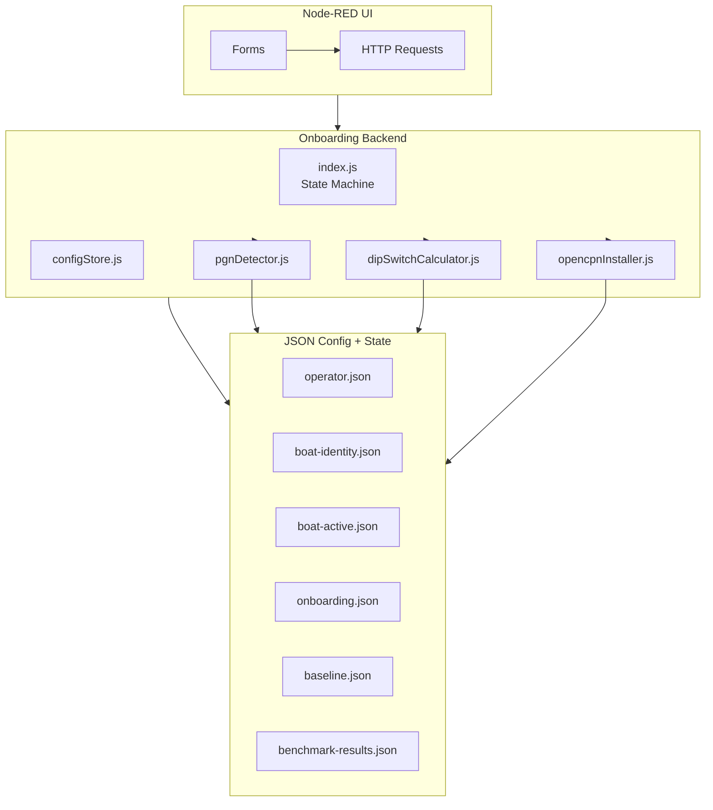
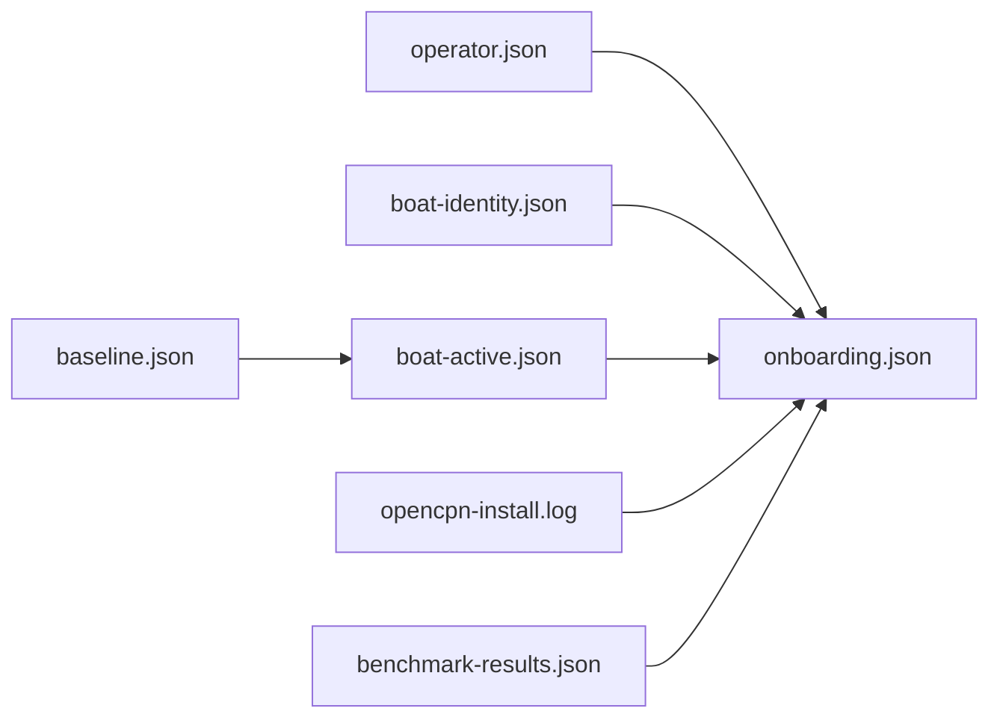
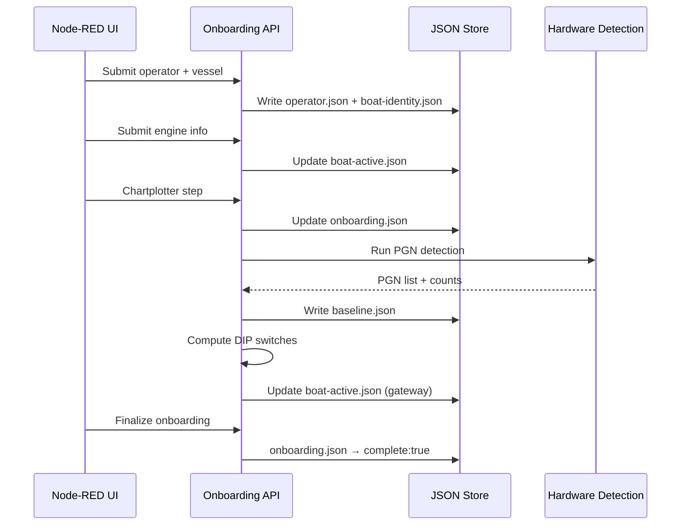

# **helm‑OS Tier‑0 — ONBOARDING FLOW**

### *Authoritative step‑by‑step logic, data handling, detection rules, and backend/UI responsibilities*

---

# **1. Overview**

The helm‑OS onboarding system transforms a fresh Raspberry Pi into a fully configured marine intelligence appliance.  
It is:

- **Deterministic** — always follows the same sequence  
- **Stateful** — resumes after reboot  
- **AI‑assisted** — fills gaps, validates, explains  
- **Hardware‑aware** — uses PGNs, CAN bus, GPS, AIS  
- **Hands‑free capable** — voice commands supported  

All onboarding logic is implemented in:

```
services/onboarding/
```

All UI is delivered through Node‑RED.

---

# **2. Onboarding State Machine**

Onboarding progresses through **10 fixed steps**:

```
1. Welcome
2. Operator + Vessel Info
3. Engine Info
4. Chartplotter Detection
5. OpenCPN Auto‑Install (conditional)
6. PGN Detection
7. DIP Switch Calculation
8. Review + Instructions
9. Benchmark Prompt
10. Main Menu (Complete)
```

The current step and all collected data are stored in:

```
state/onboarding.json
```

If the Pi reboots, onboarding resumes from the last step.

---

# **3. Step‑by‑Step Flow**

## **3.1 Step 1 — Welcome**
- Display introduction  
- Confirm hardware presence (PiCAN‑M, GPS, AIS, microphone)  
- Enable voice commands (“Start onboarding”, “Next step”)  

**Backend:** No data stored yet.

---

## **3.2 Step 2 — Operator + Vessel Info**
User provides:
- Operator alias  
- Boat name  
- Boat type  
- Optional dimensions  

**AI responsibilities:**
- Validate fields  
- Normalize names  
- Fill missing values if user is unsure  

**Stored in:**
```
config/operator.json
config/boat-identity.json
```

---

## **3.3 Step 3 — Engine Info**
User provides:
- Manufacturer  
- Model  
- Number of engines  

**AI responsibilities:**
- Cross‑check with PGNs (later)  
- Flag impossible combinations  
- Infer engine type if user doesn’t know  

**Stored in:**
```
config/boat-active.json
```

---

## **3.4 Step 4 — Chartplotter Detection**
System checks for chartplotter presence using:

- PGN scan  
- Known manufacturer PGNs  
- `scripts/detect-chartplotter.sh`

**If chartplotter exists:**  
→ Skip OpenCPN installation.

**If no chartplotter:**  
→ Proceed to Step 5.

**Stored in:**  
`state/onboarding.json → data.chartplotter`

---

## **3.5 Step 5 — OpenCPN Auto‑Install (Conditional)**
Triggered only when **no chartplotter** is detected.

Backend runs:

```
scripts/install-opencpn.sh
```

Installs:
- OpenCPN  
- Signal K plugin  
- AIS/GPS integration  
- Chart directories  

**Stored in:**  
`state/opencpn-install.log`

---

## **3.6 Step 6 — PGN Detection**
Backend listens to CAN bus for ~10 seconds:

- Runs `candump`  
- Extracts PGNs  
- Counts frequency  
- Identifies:
  - Engine PGNs  
  - Navigation PGNs  
  - AIS/GPS  
  - Gateway presence  

**AI responsibilities:**
- Interpret PGN set  
- Infer engine type  
- Detect missing sensors  

**Stored in:**  
`state/baseline.json`

---

## **3.7 Step 7 — DIP Switch Calculation**
Backend computes CX5106 DIP switch settings using:

- Engine info  
- PGN set  
- Chartplotter presence  
- Manufacturer rules  

**AI responsibilities:**
- Explain DIP logic in plain English  
- Validate PGN/engine consistency  

**Stored in:**  
`config/boat-active.json → gateway`

UI displays:
- DIP switch diagram  
- Mode  
- Notes  
- Instructions  

---

## **3.8 Step 8 — Review + Instructions**
User sees a summary of:

- Operator + vessel  
- Engine  
- Chartplotter status  
- PGNs detected  
- DIP switch settings  
- OpenCPN status  

User confirms → onboarding finalizes.

---

## **3.9 Step 9 — Benchmark Prompt**
User is asked:

> “Would you like to run a 30‑minute engine benchmark now?”

If yes:
- `helm-benchmark.service` starts  
- Data stored in `config/benchmark-results.json`

If no:
- User can run benchmark later.

---

## **3.10 Step 10 — Main Menu (Complete)**
Onboarding is marked complete:

```
state/onboarding.json → complete: true
```

Node‑RED switches to the main UI:
- Engine dashboard  
- OpenCPN launcher  
- Health monitor  
- Benchmarking  
- Voice assistant  

---

# **4. Backend Responsibilities**

The onboarding backend handles:

### **4.1 State Management**
- Reads/writes onboarding state  
- Computes next step  
- Ensures deterministic flow  

### **4.2 Data Persistence**
- Writes all config to JSON  
- Ensures reproducibility  
- Survives power loss  

### **4.3 Hardware Detection**
- PGN scanning  
- Chartplotter detection  
- Engine inference  

### **4.4 DIP Switch Logic**
- Rule‑based evaluation  
- Safe fallback mode  
- Human‑readable explanations  

### **4.5 Service Orchestration**
- OpenCPN installation  
- Benchmarking service  
- Health monitoring  

---

# **5. Node‑RED Responsibilities**

Node‑RED provides:

- UI screens for each onboarding step  
- Forms for user input  
- Buttons for actions  
- HTTP request nodes calling backend APIs  
- Voice assistant triggers  

Node‑RED **does not** store data or compute logic.

---

# **6. Voice Assistant Integration**

Voice commands during onboarding:

- “Start onboarding”  
- “Next step”  
- “What’s my engine type”  
- “Do I need OpenCPN”  
- “Explain my DIP switches”  

Backend uses:
- Vosk STT  
- Intent router  
- Piper TTS  

---

# **7. Completion Criteria**

Onboarding is considered complete when:

- Operator + vessel info stored  
- Engine info stored  
- Chartplotter detected  
- OpenCPN installed (if needed)  
- PGNs detected  
- DIP switches computed  
- Review accepted  
- Benchmark prompt shown  
Absolutely, Don — here is a **clean, GitHub‑ready data‑model diagram** for helm‑OS Tier‑0 onboarding.  
It captures every JSON file, its fields, and how they relate to each other and to the onboarding flow.

You can drop this directly into:

```
docs/DATA_MODEL.md
```

# **helm‑OS Tier‑0 — DATA MODEL**

### *Authoritative data structures, JSON schemas, and relationships for onboarding, detection, and runtime configuration*

---

# **1. Overview**

helm‑OS uses a **JSON‑based configuration model**.  
Every onboarding step writes to one or more JSON files, and every runtime service reads from them.

The data model is intentionally:

- **Flat** (no databases)  
- **Deterministic** (same inputs → same outputs)  
- **Human‑readable**  
- **Version‑controllable**  
- **Safe under power loss**  

---

# **2. High‑Level Data Model Diagram**

erDiagram

    OPERATOR {
        string alias
        string email optional
    }

    BOAT_IDENTITY {
        string name
        string type
        number length optional
        number beam optional
        number draft optional
    }

    BOAT_ACTIVE {
        string manufacturer
        string model
        number engine_count
        json gateway
        json sensors optional
    }

    ONBOARDING_STATE {
        string step
        boolean complete
        json data
    }

    BASELINE {
        number[] pgns
        json counts
    }

    OCPN_STATUS {
        boolean installed
        string log_path
    }

    BENCHMARK_RESULTS {
        json engine_curves
        json anomalies
        string timestamp
    }

    %% Relationships
    OPERATOR ||--|| ONBOARDING_STATE : "collected in"
    BOAT_IDENTITY ||--|| ONBOARDING_STATE : "collected in"
    BOAT_ACTIVE ||--|| ONBOARDING_STATE : "collected in"

    BASELINE ||--|| BOAT_ACTIVE : "PGN detection informs engine + gateway"
    OCPN_STATUS ||--|| ONBOARDING_STATE : "OpenCPN install step"
    BENCHMARK_RESULTS ||--|| ONBOARDING_STATE : "optional final step"
```

---

# **3. File‑Level Data Model**

Below is the authoritative list of JSON files, their purpose, and their structure.

---

## **3.1 `config/operator.json`**

Stores operator identity.

```json
{
  "alias": "Don",
  "email": "optional"
}
```

---

## **3.2 `config/boat-identity.json`**

Stores vessel identity.

```json
{
  "name": "Sea Breeze",
  "type": "Powerboat",
  "length": 31,
  "beam": 11.5,
  "draft": 3.2
}
```

---

## **3.3 `config/boat-active.json`**

Stores engine + gateway configuration.

```json
{
  "engine": {
    "manufacturer": "Yanmar",
    "model": "4JH",
    "count": 1
  },
  "gateway": {
    "ruleId": "single_engine_no_plotter",
    "switches": [1, 0, 0, 0],
    "mode": "ENGINE_TO_N2K",
    "notes": "Single engine, no chartplotter, basic engine PGNs present."
  },
  "sensors": {
    "gps": true,
    "ais": true
  }
}
```

---

## **3.4 `state/onboarding.json`**

Tracks onboarding progress.

```json
{
  "step": "pgn_detection",
  "complete": false,
  "data": {
    "operator": {},
    "vessel": {},
    "engine": {},
    "chartplotter": {},
    "pgns": {},
    "gateway": {}
  }
}
```

---

## **3.5 `state/baseline.json`**

Stores PGN detection results.

```json
{
  "pgns": [127488, 127489, 127505],
  "counts": {
    "127488": 120,
    "127489": 95,
    "127505": 30
  }
}
```

---

## **3.6 `state/opencpn-install.log`**

Not JSON — raw log file.

Contains:

- apt output  
- plugin installation logs  
- timestamps  

---

## **3.7 `config/benchmark-results.json`**

Stores engine performance benchmark.

```json
{
  "timestamp": "2026-01-31T14:22:00Z",
  "engine_curves": {
    "rpm": [...],
    "temperature": [...],
    "fuel_rate": [...],
    "voltage": [...]
  },
  "anomalies": [
    {
      "type": "temperature_spike",
      "severity": "medium",
      "details": "Port engine coolant rose 12°C above baseline."
    }
  ]
}
```

---

# **4. Data Flow Diagram**



---

# **5. Data Dependencies**



---

# **6. How Data Evolves During Onboarding**



---

# **7. Summary**

The helm‑OS data model is:

- **Simple** — JSON everywhere  
- **Deterministic** — no hidden state  
- **Traceable** — every step leaves a file  
- **Hardware‑aware** — PGNs drive configuration  
- **Extensible** — new rules, sensors, engines can be added  

This model is the backbone of the entire Tier‑0 system.

---


---

